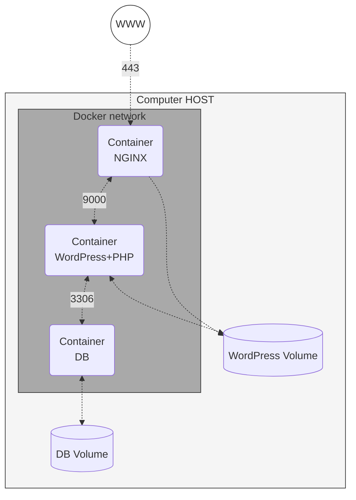

# Inception

## General Guidelines

- The project needs to be done on a Virtual Machine
- All the files required for the configuration must be placed in a `srcs` folder
- A Makefile is also required and must be located at the root of the directory.
  It must set up the entire application (i.e., it has to build the Docker images 
  using `docker-compose` and start the containers).

## Mandatory Part

We have to set up a small infrastructure composed of different services.
The whole project has to be done using Docker and Docker-Compose.

- Each Docker image must have the same name as its corresponding service
- Each service has to run in a dedicated container
- The containers must be built from the penultimate stable version of Debian.
- It has to be written one Dockerfile per service
- The Dockerfiles must be called in the `docker-compose.yml` by Makefile.
- This means we have to build the Docker images ourselves
- It is forbidden to pull ready made Docker images from DockerHub (Debian being
  excluded from this rule)
- We have to set up:
  - A Docker container that contains NGINX with TLSv1.3 only
  - A Docker container that contains WordPress + php-fpm (it must be installed
    and configure) only, without nginx
  - A Docker container that contains MariaDB only, without nginx
  - A volume that contains our WordPress database
  - A second volume that contains our WordPress website files
  - We must use Docker **named volumes** for these two persistent data storages.
    Bind mounts are **not allowed** for these volumes.
  - Both named volumes must store their data inside `/home/login/data` on the host.
    Replace `login` with your actual login.
  - A `docker-network` that establishes the connection between the containers.

- The containers have to restart in case of a crash.
- Using host or --link or links is forbidden.
- The network line must be present in the docker-compose.yml file.
- The containers must not be started with a command running an infinite loop,
  this also applies to any command used as entrypoint, or used in entrypoint scripts.
- The following are a few prohibited hacky patches: tail -f, bash, sleep infinity,
  while true, etc.
- In the WordPress database, there must be two users, one of them being the
  administrator. The administrator's username can't contain admin/Admin or
  administrator/Administrator.
- The volumes will be available in the /home/login/data folder of the host machine.
  Replace login with your actual login.
- We have to configure our domain name so it points to our local IP address.
  This domain name must be `login.42.fr`, replacing login with the actual login.
- The latest tag is prohibited in the docker-compose.yml file.
- No password must be present in the docker-compose.yml file.
- It is mandatory to use environment variables to set passwords.
- It is mandatory to use a .env file to store these environment variables.
- It is recommended to use Docker secrets to store confidential information.
- The NGINX container must be the only entrypoint into the infrastructure via
  HTTPS on port 443 using TLSv1.3 only.

